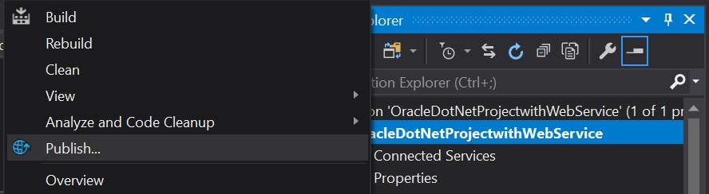

# How to add a web service.

[This video](https://www.youtube.com/watch?v=1VU8fyaHzO0) explained how to do it for me.

First, let's create a ASP.NET MVC Web Application.

After that step, the core project should now have been created.
Lets now add a web service.

Hover over your solution, right click on it, and then go Add -> New Item.

 

Then, scroll down and add a web service

 

You have now added a web service. 
If you run the application, you should be able to see the application at:
https://localhost:44393/WebService.asmx

The port number may be different depending on how you've set it up.

Let's integrate it with the application.
We will need to publish the project.

 

We now need to add a service reference.

 

Lastly, double check that the System Web Services is enabled as a web service.
To do this, look at image 8 (From References -> Add Reference -> System.Web.Services).

 

Once that last step is completed, you have successfully added a web service to the project.